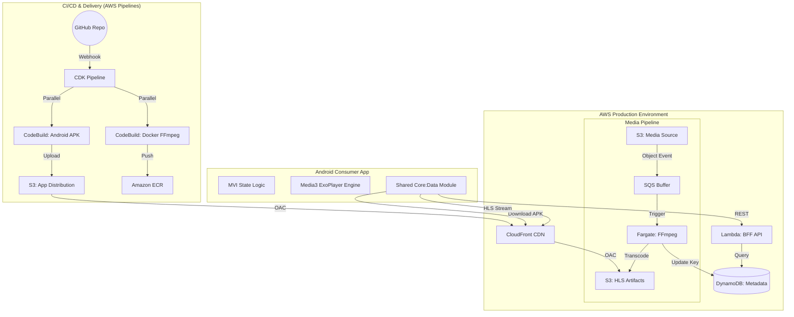

# Personal Streaming Service — Portfolio Project

A self-hosted "mini Netflix": rip physical media I own, transcode it to adaptive streaming formats, store it in AWS, and stream it to my family on laptop, iPhone, and Android — with DRM, adaptive bitrate, captions, and LLM-powered recommendations.

**Goal:** Prove hands-on competence across a broad media + mobile + cloud + applied-GenAI skill set by building the whole thing end to end, capturing proof, and tearing it down. This is a **portfolio spike**, not a permanent product.

> **Personal project notice:** This is built entirely on personal infrastructure (personal computer, personal AWS account on my own card) — deliberately separate from any Amazon internal systems, accounts, or build tooling.

---

## 🚀 Onboarding & Deployment

If you are a developer looking to deploy this system into your own AWS account, follow these steps:

### 1. Prerequisite: AWS & GitHub Setup
- **AWS Account**: Ensure you have an active AWS account and the AWS CLI configured locally.
- **GitHub Connection**: 
    - Go to **AWS Console** -> **CodePipeline** -> **Settings** -> **Connections**.
    - Create a new **GitHub** connection and name it `github-streaming-connection`.
    - Note the **Connection ARN**.
- **Fork the Repo**: Fork this repository to your own GitHub account.

### 2. Configure the Cloud Environment
Update the centralized configuration file: [**`infrastructure/bin/config.ts`**](./infrastructure/bin/config.ts).
- `account`: Your 12-digit AWS Account ID.
- `region`: Your target AWS Region (e.g., `us-east-1`).
- `githubRepo`: Your forked repository path (e.g., `your-username/Personal-Video-Streaming-Service`).
- `githubConnectionArn`: The ARN of the connection you created in Step 1.

### 3. Bootstrap the Pipeline
Run the following commands from the `infrastructure/` directory:
```powershell
npm install
npx cdk bootstrap
npx cdk deploy StreamingPipelineStack
```

### 4. Close the Loop
- **First Build**: The pipeline will trigger automatically. Once the `Synth` and `ParallelBuilds` stages finish, the infrastructure will be live.
- **Android API URL**: 
    - Find the `ApiUrl` in the **CloudFormation** -> `Prod-ApiStack` -> **Outputs**.
    - Update `core/data/build.gradle.kts` with this new URL.
- **Git Push**: Push the URL change to GitHub. The pipeline will build the final APK with the correct backend link.

### 5. SDE Note: Manual Values
The following files contain account-specific values that **must** be updated:
- [**`infrastructure/bin/config.ts`**](./infrastructure/bin/config.ts): AWS Account, Region, GitHub Repo, and Connection ARN.
- [**`core/data/build.gradle.kts`**](./core/data/build.gradle.kts): The dynamically generated `BASE_URL` for the API.

---

## 📚 Project Documentation

### Core Architecture & Strategy
- [**System Design & ADR**](./docs/system-design.md): Deep dive into the architecture, component breakdown, and a log of every major design trade-off (ADR).
- [**AWS Resource Inventory**](./docs/aws-resource-inventory.md): A detailed list of all major AWS services used and the role they play in the final design.
- [**AI Collaboration Log**](./docs/ai-collaboration.md): Evidence of leveraging GenAI as a force-multiplier, documenting 40+ milestones and "SDE Pro" decisions.
- [**Service Checklist**](./docs/service-checklist.md): The "Production-Ready" smoke test for verifying system integrity after major deployments.

### Knowledge & Mastery
- [**Knowledge Audit**](./docs/knowledge-audit.md): A self-assessment tool covering media, Android, and cloud internals.
- [**Glossary**](./docs/streaming-project-glossary.md): Plain-language definitions of every technology used (HLS, ABR, DRM, MVI, etc.).

### Project Management
- [**Definition of Done**](./docs/streaming-project-definition-of-done.md): The execution roadmap, milestones, and project tracking.
- [**Infrastructure Details**](./docs/infrastructure-readme.md): Specifics on the CDK-based cloud backend.
- [**Deployment Plans**](./docs/plans/): A folder containing detailed implementation strategies for every major feature.

---

## The Big Picture (Architecture)



---

## Requirement coverage (summary)

Full mapping is in the definition-of-done. High level, this project demonstrates:

- **Media:** HLS (preferred) + DASH, ABR algorithms, CEA-608/708 captions, codecs (AVC/HEVC/AAC/EAC3), DRM (Widevine; PlayReady conceptually)
- **Android:** SDK/lifecycles, thread management, custom views, Compose + animations, MVVM + MVI, Flow (reactive), Hilt/DI
- **Cloud:** S3, CloudFront, signed URLs, serverless backend
- **Applied GenAI:** AWS Bedrock recommendations (RAG pattern, hallucination-guarded)
- **Quality:** unit tests + Android Profiler

---

## Cost & safety guardrails

- Personal AWS account (own card); AWS Budget alarm set on day one (~$10).
- **FinOps Optimization**: Removed Interface Endpoints to achieve **$0.00 idle cost** while maintaining full functionality.
- **Transcoder Tuning**: Boosted Fargate to 4 vCPUs for 10x faster encoding at a lower total cost.
- Target total out-of-pocket: a few dollars.

---

## Legal & Ethical Considerations (Private Spike Notice)

This project is a **private portfolio spike** intended for technical demonstration only. It is not designed for public release or commercial use.

1.  **Copyrighted Content**: Content used during development and testing is limited to legally obtained personal media (home videos) or open-source trailers.
2.  **Privacy by Design**: The "Parental Screen Time" feature utilizes **Jetpack DataStore** for local-only session tracking. Zero usage data is transmitted to external servers.
3.  **DRM Implementation**: DRM demonstrations are for the purpose of proving technical integration capability with licensed industry standards.
4.  **Intellectual Property**: This project is independent of any commercial entities and is built using personal infrastructure.

---

## Status

- [x] Project scoped, documented, glossary + plan written
- [x] Milestone 1 — Basic local playback
- [x] Milestone 2 — Cloud Infrastructure & Automated Pipeline
- [x] Milestone 3 — HLS Transcoding Engine (Live!)
- [ ] Milestone 4 — Administrator Content Ingestion
- [ ] Milestone 5 — Secure Streaming (Signed URLs)
