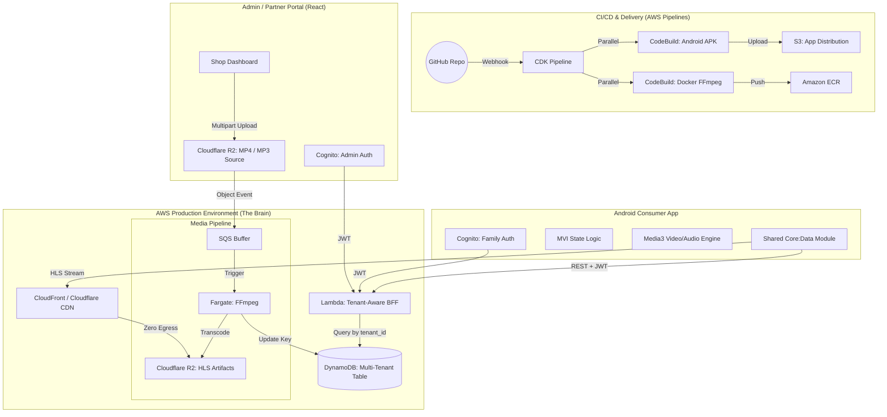

# System Design: Personal Video Streaming Service

This document provides a high-level visual and technical overview of the architecture. It is a living document that tracks the evolution of the project from a local prototype to a distributed, automated cloud system.

## 1. High-Level Architecture

---

## 2. Component Breakdown

### A. Android Release Engine (CI/CD)
*   **Unified Pipeline**: Orchestrates both Infrastructure (CDK) and Application (Android) code. A single `git push` results in a new cloud deployment and a downloadable APK.
*   **Parallel Build Waves**: Executes Docker image building and Android compilation on independent servers simultaneously to minimize release latency.

### B. Media Processing Pipeline
*   **Polymorphic Container Architecture**: Reuses the same Fargate Docker image for two distinct operation roles (`CONTAINER_MODE` variable), maximizing asset utility and simplifying CI/CD.
*   **Human-in-the-Loop Intake**: Automatically extracts a 2-second thumbnail frame and invokes AWS Bedrock (Claude 3 Haiku) to generate default metadata drafts (`aiTitle`, `aiDescription`, `aiTags`) inside a low-compute Fargate profile, staging the asset in a `REVIEW_PENDING` lock.
*   **Deferred Transcoding**: Delays heavy multi-bitrate HLS segmentation until a human operator has reviewed, adjusted, and approved the metadata in the Demetrius Portal, eliminating compute waste on bad uploads.

### C. Backend API (BFF)
*   **Late Binding**: The Lambda function constructs CloudFront URLs at runtime based on environment variables, keeping the database infrastructure-agnostic.

---

## 3. Architecture Decision Log (ADR) & Trade-offs

This section documents the "Why" behind our engineering choices, representing Lead SDE-level decision-making.

### 1. Compute: Fargate vs. EC2 for Transcoding
*   **Decision**: **AWS ECS Fargate**.
*   **Trade-off**: Slightly higher cost-per-second vs. **Zero Maintenance & Unlimited Scaling**.
*   **Reasoning**: For a media pipeline, immutability is key. Fargate ensures every transcode starts from a clean Docker image. By boosting to 4 vCPUs, we optimized for **Total Cost**, as the task finishes 10x faster, resulting in a lower total bill than a slow EC2 instance.

### 2. Networking: Public IGW vs. Private VPC Endpoints
*   **Decision**: **Public Internet Gateway with S3 Gateway Endpoint**.
*   **Trade-off**: ~$21/month savings vs. Potential "Network Jitter" during image pulls.
*   **Reasoning**: In a portfolio "spike" phase, $0.00 idle cost is a priority. We retained the S3 Gateway Endpoint (which is free) to keep heavy video data on the private AWS backbone while moving API handshakes to the public internet.

### 3. Data Strategy: Late Binding vs. Physical URLs
*   **Decision**: **Logical Keys in DynamoDB**.
*   **Trade-off**: Tiny Lambda runtime overhead vs. **Extreme Portability**.
*   **Reasoning**: Storing `s3://bucket-id/movie.mp4` creates "Data Debt." If the bucket ID changes, the database breaks. By storing only the `videoKey` and letting the Lambda build the URL, the system survives regional migrations and infrastructure recreations with zero data modification.

### 4. Pipeline Design: Parallel vs. Sequential
*   **Decision**: **Parallel Build Waves**.
*   **Trade-off**: Higher CodeBuild Free-Tier consumption vs. **50% faster release velocity**.
*   **Reasoning**: Lead Engineers prioritize "Developer Flow." By building Docker and Android in parallel, we reduced the feedback loop from 15 minutes to ~7 minutes, enabling faster iteration.

### 5. Android Architecture: MVI vs. MVVM
*   **Decision**: **Strict MVI (Model-View-Intent)**.
*   **Trade-off**: More boilerplate code vs. **Atomic State & Predictability**.
*   **Reasoning**: High-end video players have dozens of overlapping states (buffering, playing, seeking). MVVM often leads to "Conflicting State" bugs. MVI makes it mathematically impossible for the UI to be inconsistent.

### 6. Android SDK Caching: S3 Bucket vs. Local Cache
*   **Decision**: **Dedicated S3 Cache Bucket**.
*   **Trade-off**: Small S3 storage fee vs. **Reliable Build Performance**.
*   **Reasoning**: Local directory caching in CodeBuild is ephemeral. By using a permanent S3 bucket, we ensured the 1.5GB Android SDK is always available over the fast AWS internal network, saving critical build minutes.

### 7. SaaS Pivot: Multi-Tenancy Strategy
*   **Backlog Decision**: **Single-Table Design with Cognito Isolation**.
*   **Trade-off**: Increased complexity in key design vs. **Unlimited Scalability & Absolute Data Isolation**.
*   **Reasoning**: To convert this into a B2B platform, we must ensure shops cannot access each other's data. Using a `TENANT#<ID>` Partition Key ensures that every query is physically scoped to a single customer, while Cognito JWTs provide the verifiable proof of identity.

### 8. Cost Management: Hybrid Cloud Migration (Stretch Goal)
*   **Backlog Decision**: **Cloudflare R2 for Media Storage**.
*   **Trade-off**: Multi-cloud complexity vs. **100% Margin Protection**.
*   **Reasoning**: AWS S3 egress fees (~$0.09/GB) are the "Silent Killer" of streaming startups. By moving delivery to Cloudflare R2 (Zero Egress), we can offer unlimited streaming to end-users at a fixed storage cost, enabling a sustainable subscription model.

### 9. Product Strategy: Multimedia Digital Vault (Audio Support)
*   **Backlog Decision**: **Poly-Container Ingestion (MP4 + MP3/FLAC)**.
*   **Trade-off**: UI complexity (Audio vs Video players) vs. **Addressable Market Expansion**.
*   **Reasoning**: Digitization shops handle more than just VHS tapes; they handle CDs and Vinyl. By supporting high-fidelity audio (FLAC) and standard mobile audio (AAC), we transform the service from a "Mini Netflix" into a complete "Family Heritage Vault," significantly increasing the "Enterprise" tier conversion rate.

### 10. Security & Compliance: Multi-Account Isolation
*   **Backlog Decision**: **Isolated Environment Accounts via AWS Organizations**.
*   **Trade-off**: Operational complexity (managing multiple logins/roles) vs. **Absolute Blast Radius Control**.
*   **Reasoning**: Alexandria+ utilizes a 4-tier account strategy:
    1. **Management**: Billing and root identity (isolated).
    2. **Tooling**: Hosts the CI/CD Release Engine and cross-account Observability.
    3. **Development**: Low-cost, unstable sandbox for prototyping.
    4. **Production**: Immutable sanctuary for customer media and financial data (Stripe).

### 11. Ingestion Strategy: Asynchronous Multipart Persistence
*   **Decision**: **Browser-Side Chunking with S3 Multipart APIs**.
*   **Trade-off**: Client-side CPU overhead vs. **Unlimited File Size & Resilience**.
*   **Reasoning**: Standard S3 PUT requests are capped at 5GB and are vulnerable to network timeouts. By implementing a custom background coordinator in React, we allow shop owners to ingest massive 4K archives (50GB+) with automated retry logic and "background" execution, ensuring the portal remains usable while data is in transit.

### 12. Branding & Identity: Custom Domain Strategy (Stretch Goal)
*   **Backlog Decision**: **Route 53 Custom Domains with ACM SSL**.
*   **Trade-off**: Additional fixed monthly cost ($0.50/mo) vs. **Professional B2B Trust**.
*   **Reasoning**: To transition Alexandria+ from a portfolio project to a commercial SaaS, custom domain support is mandatory. Utilizing Route 53 with Alias records ensures zero additional latency and provides a professional entry point (e.g., `alexandria-plus.com/demetrius`) for shop partners, while ACM provides managed, auto-renewing security certificates at zero cost.

### 13. Business Architecture: Platform-First (D2C + B2B Channel)
*   **Decision**: **Subscription to Platform / One-Time Fee to Shop**.
*   **Trade-off**: Increased onboarding complexity vs. **Maximum Resilience & Customer Lifetime Value**.
*   **Reasoning**: By owning the direct billing relationship with the family, Alexandria+ ensures that a family's library is not tied to the lifespan of a single local shop. The "Authorized Archivist" model (using temporary Ingestion Keys) allows shops to generate high-margin archival revenue without the overhead of managing long-term recurring billing for their customers, creating a scalable, decentralized channel for library growth.

### 14. Distribution: Multi-Target Ecosystem
*   **Backlog Decision**: **Cross-Platform Delivery (Web, Android, iOS, Roku)**.
*   **Trade-off**: Development overhead of native clients vs. **Maximum Accessibility**.
*   **Reasoning**: To fulfill the mission of "Rebuilding the Great Library," content must be accessible wherever the family is. By utilizing industry-standard HLS and a unified serverless API, we can deploy low-latency viewing experiences across the entire device spectrum—phones, tablets, laptops, and living-room TVs—with 100% asset compatibility.

### 15. Ingestion Sequence: Polymorphic Container & Human-in-the-Loop Optimization
*   **Decision**: **Bifurcated `CONTAINER_MODE` inside a Single Docker Image, staging under `REVIEW_PENDING` before full HLS transcode**.
*   **Trade-off**: Minor code branching complexity inside the transcoder image vs. **Extreme FinOps Efficiency & Zero Compute Waste**.
*   **Reasoning**: Running large multi-bitrate transcodes on heavy 4-vCPU Fargate instances before metadata confirmation can waste massive compute dollars on bad or unwanted files. Reusing the exact same Docker image with a low-horsepower memory/CPU override during `METADATA_EXTRACT` allows fractions-of-a-penny ingestion metadata extraction via Bedrock, ensuring heavy compute clusters are strictly reserved for human-vetted content.
