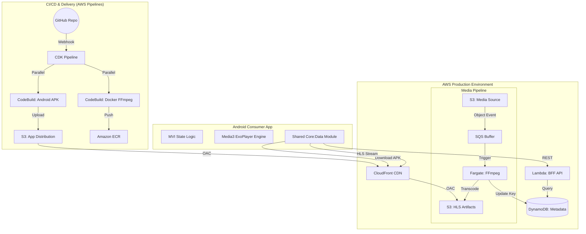

# System Design: Personal Video Streaming Service

This document provides a high-level visual and technical overview of the architecture. It is a living document that tracks the evolution of the project from a local prototype to a distributed, automated cloud system.

## 1. High-Level Architecture

---

## 2. Component Breakdown

### A. Android Release Engine (CI/CD)
*   **Unified Pipeline**: Orchestrates both Infrastructure (CDK) and Application (Android) code. A single `git push` results in a new cloud deployment and a downloadable APK.
*   **Parallel Build Waves**: Executes Docker image building and Android compilation on independent servers simultaneously to minimize release latency.

### B. Media Processing Pipeline
*   **Event-Driven Transcoding**: Uses an S3-to-SQS trigger to decouple ingestion from processing.
*   **Serverless FFmpeg**: Leverages **AWS ECS Fargate** for immutable, high-performance transcoding without managed servers.
*   **ABR Ladder**: Automatically "shreds" MP4s into a 3-tier HLS bitrate ladder (1080p, 720p, 480p).

### C. Backend API (BFF)
*   **Late Binding**: The Lambda function constructs CloudFront URLs at runtime based on environment variables, keeping the database infrastructure-agnostic.

---

## 3. Architecture Decision Log (ADR) & Trade-offs

This section documents the "Why" behind our engineering choices, representing Lead SDE-level decision-making.

### 1. Compute: Fargate vs. EC2 for Transcoding
*   **Decision**: **AWS ECS Fargate**.
*   **Trade-off**: Slightly higher cost-per-second vs. **Zero Maintenance & Unlimited Scaling**.
*   **Reasoning**: For a media pipeline, immutability is key. Fargate ensures every transcode starts from a clean Docker image. By boosting to 4 vCPUs, we optimized for **Total Cost**, as the task finishes 10x faster, resulting in a lower total bill than a slow EC2 instance.

### 2. Networking: Public IGW vs. Private VPC Endpoints
*   **Decision**: **Public Internet Gateway with S3 Gateway Endpoint**.
*   **Trade-off**: ~$21/month savings vs. Potential "Network Jitter" during image pulls.
*   **Reasoning**: In a portfolio "spike" phase, $0.00 idle cost is a priority. We retained the S3 Gateway Endpoint (which is free) to keep heavy video data on the private AWS backbone while moving API handshakes to the public internet.

### 3. Data Strategy: Late Binding vs. Physical URLs
*   **Decision**: **Logical Keys in DynamoDB**.
*   **Trade-off**: Tiny Lambda runtime overhead vs. **Extreme Portability**.
*   **Reasoning**: Storing `s3://bucket-id/movie.mp4` creates "Data Debt." If the bucket ID changes, the database breaks. By storing only the `videoKey` and letting the Lambda build the URL, the system survives regional migrations and infrastructure recreations with zero data modification.

### 4. Pipeline Design: Parallel vs. Sequential
*   **Decision**: **Parallel Build Waves**.
*   **Trade-off**: Higher CodeBuild Free-Tier consumption vs. **50% faster release velocity**.
*   **Reasoning**: Lead Engineers prioritize "Developer Flow." By building Docker and Android in parallel, we reduced the feedback loop from 15 minutes to ~7 minutes, enabling faster iteration.

### 5. Android Architecture: MVI vs. MVVM
*   **Decision**: **Strict MVI (Model-View-Intent)**.
*   **Trade-off**: More boilerplate code vs. **Atomic State & Predictability**.
*   **Reasoning**: High-end video players have dozens of overlapping states (buffering, playing, seeking). MVVM often leads to "Conflicting State" bugs. MVI makes it mathematically impossible for the UI to be inconsistent.

### 6. Android SDK Caching: S3 Bucket vs. Local Cache
*   **Decision**: **Dedicated S3 Cache Bucket**.
*   **Trade-off**: Small S3 storage fee vs. **Reliable Build Performance**.
*   **Reasoning**: Local directory caching in CodeBuild is ephemeral. By using a permanent S3 bucket, we ensured the 1.5GB Android SDK is always available over the fast AWS internal network, saving critical build minutes.
