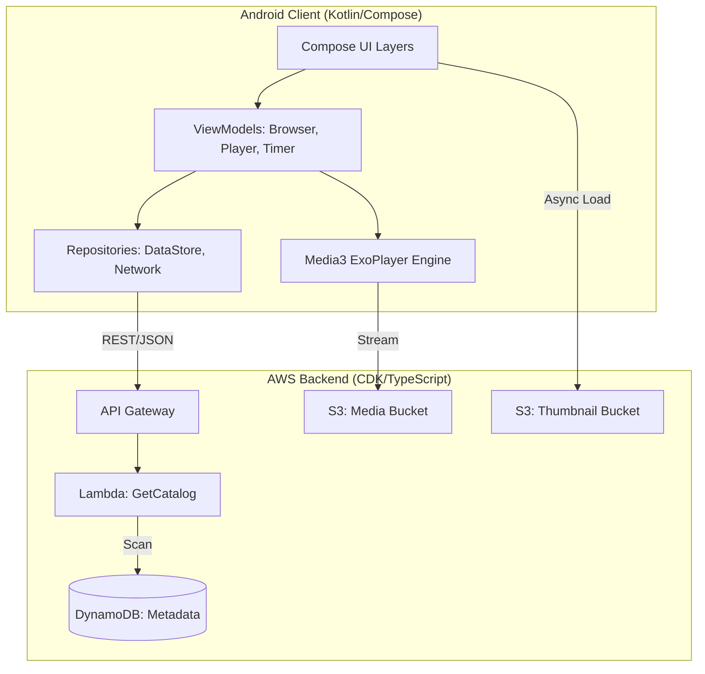

# System Design: Personal Video Streaming Service

This document provides a high-level visual and technical overview of the architecture. It is a living document that tracks the evolution of the project from a local prototype to a distributed cloud system.

## 1. High-Level Architecture

---

## 2. Component Breakdown

### A. Android Client
*   **UI Layer**: Built with **Jetpack Compose**. Uses a `NavHost` for professional screen transitions and `LazyColumn` for a high-performance catalog menu.
*   **Logic Layer (MVVM)**: 
    *   `MediaBrowserViewModel`: Orchestrates media discovery from the cloud.
    *   `VideoPlayerViewModel`: Manages the lifecycle of the ExoPlayer engine.
    *   `ScreenTimeViewModel`: Global session manager for parental tracking.
*   **Data Layer**:
    *   **Retrofit**: Type-safe REST client for fetching movie metadata.
    *   **DataStore**: Thread-safe persistent storage for local usage statistics.
    *   **Coil**: Optimized, edge-cached image loading for thumbnails.

### B. Cloud Backend (Serverless)
*   **Infrastructure as Code (CDK)**: Entire backend is defined in TypeScript, allowing for 1-click deployments and teardowns.
*   **BFF (Backend-for-Frontend)**: The Lambda function acts as a proxy, cleaning and formatting DynamoDB data specifically for the Android app's needs.
*   **Storage Strategy**: Direct S3 access for Milestone 1; transitioning to **CloudFront** (CDN) for Milestone 2 to support Adaptive Bitrate Streaming (ABR).

---

## 3. Core Data Flows

### Media Discovery
1.  User opens app.
2.  `MediaBrowserViewModel` triggers a `GET /catalog` via Retrofit.
3.  Lambda scans DynamoDB and returns JSON.
4.  Android app maps JSON to `MediaFile` objects and renders the `LazyColumn`.

### Media Playback
1.  User taps a title.
2.  Navigator passes the `videoUrl` to the `VideoPlayerViewModel`.
3.  ExoPlayer opens an HTTPS connection to the S3 bucket.
4.  The hardware decoders begin rendering the stream.

---

## 4. Strategic Engineering Decisions

| Decision | Why? |
| :--- | :--- |
| **BFF Pattern** | Avoids AWS SDK bloat on Android and hides database schema details from the client. |
| **Reactive Polling** | Used a 200ms coroutine loop for progress tracking to balance visual smoothness with battery life. |
| **Locale Invariance** | Forced `Locale.US` for storage keys to prevent "Midnight Bugs" in different regions. |
| **State Gates** | Implemented a "Switch" in the ScreenTime timer to ensure tracking only occurs during active playback. |
